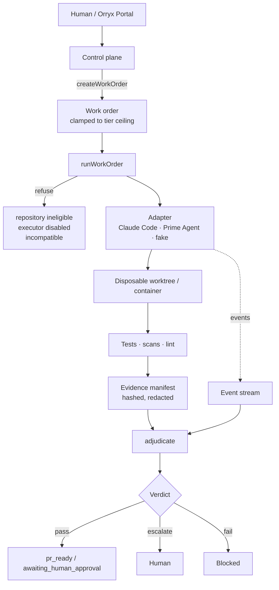

# `@orryx/executor` — provider-neutral execution boundary

Zero runtime dependencies. Node ≥ 20. ESM.

The control plane decides *what* may happen and *whether it worked*.
An executor decides *how*. Nothing an executor says can change the verdict.



The dotted line matters: events inform adjudication, they do not decide it.
`adjudicate()` reads the **manifest**. A `completed` event with an empty manifest
returns `escalate`, and `run.integration.test.js` asserts it.

## Modules

| File | Responsibility |
|---|---|
| `risk.js` | Risk tiers, per-tier ceilings, trust levels. Constitutional. |
| `eligibility.js` | Per-repository data class, delegation ceiling, provider policy. |
| `work-order.js` | Build + validate a work order. Deny-all defaults; widening is an error, never a clamp. |
| `events.js` | The 13 event types, monotonic sequencing, terminal-state rule. |
| `budget.js` | Cost / wall-clock / token / iteration ledger. Warns at 75%, escalates at 90%, stops at 100%. |
| `evidence.js` | Hashed, redacted evidence manifest with provenance. |
| `adjudicate.js` | Independent verdict. Ignores self-certification. |
| `redact.js` | Secret redaction for logs, events and evidence. |
| `logging.js` | Structured JSONL. |
| `executor.js` | The adapter contract and its capability declaration. |
| `config.js` | Feature flags, isolation and credential validation. |
| `run.js` | The runner. The only place an adapter is invoked. |
| `adapters/fake-executor.js` | Scripted fake. Reference implementation. |
| `adapters/prime-agent-executor.js` | Stub. Off by default. Cannot claim success. |

## Usage

```js
import { createWorkOrder, runWorkOrder, validateConfig, FakeExecutor } from '@orryx/executor';

const { ok, workOrder, errors } = createWorkOrder({
  work_order_id: 'WO-2026-001',
  initiative: 'test-coverage',
  repository: 'orryx-delivery-dashboard',
  objective: 'Add cases for lib/derive/whats-broken.js',
  acceptance_criteria: ['three new passing cases', 'no production file modified'],
  risk_tier: 'R1',
  required_evidence: { tests: ['node-test-run'] },
});
if (!ok) throw new Error(errors.join('; '));

const { config } = validateConfig();
const result = await runWorkOrder({ workOrder, executor: new FakeExecutor([...]), config });
// result.verdict      'pass' | 'fail' | 'escalate'
// result.merge_path   'pr_ready' | 'awaiting_human_approval' | 'escalate' | 'blocked' | 'fail'
// result.resume_state  replay this to continue after a crash
```

## Guarantees, each with a test

- An executor cannot mark itself successful — `adjudicate.test.js`, `run.integration.test.js`
- A work order cannot exceed its tier ceiling — rejected, not clamped — `work-order.test.js`
- `may_push_protected` is never grantable — `work-order.test.js`
- Governance files are always in the deny list, whatever the caller passes — `work-order.test.js`
- PHI and unclassified repositories are refused before any adapter code runs — `run.integration.test.js`
- Budgets are enforced on the control plane's clock — `budget-events-redact.test.js`
- Resume carries spend and history forward; a recovered crash is not a failure — `run.integration.test.js`
- A real executor cannot be enabled without isolation — `eligibility-config.test.js`
- A subscription credential needs an explicit local-experiment acknowledgement — `eligibility-config.test.js`

## Test

```bash
node --test
```

```bash
node --test --experimental-test-coverage
```

63 tests, 14 suites. 92.9% line, 82.3% branch coverage as of 2026-08-09.

## Status

`PrimeAgentExecutor` is a **stub**: `available = false`, and it emits
`blocked` + `stopped` rather than pretending to work. Live integration needs a
container/VM boundary and a metered API credential — see
`docs/pilot/prime-agent-pilot-runbook.md`.

If integrating a harness appears to require editing `risk.js`, `work-order.js` or
`adjudicate.js`, stop. That is the integration failing, not the governance.
